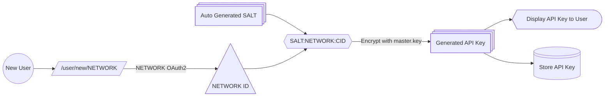
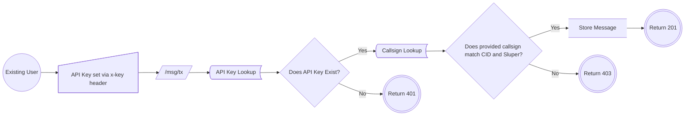
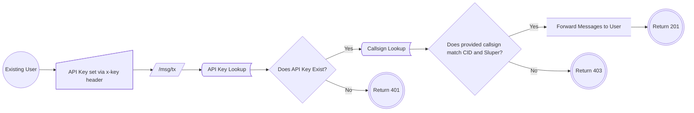

# SimACARS

This is a simulated ACARS network for flight simulation only.

If you are flying on a network, your API key is an encrypted string of SECRET:NETWORK:USER_ID.

Your network user ID is used to verify that the callsign you have logged on with.

Your user ID is verified using your network's OAuth2 protocol. We ONLY store your encrypted user ID and flight simulation network and no other personal data.

# Running Locally
### Dependencies
 - Python >= 3.14.4
 - Python pip >= 26.1.1
 - Git >= 2.54.0 (windows)
 - Redis >= 8.0.0
### Getting Started (Visual Studio Code)
    git clone https://github.com/SimACARS/acars-server.git
   Create and activate a virtual environment

    pip install -r requirements.txt
    fastapi dev
Browse to http://127.0.0.1:8000 for the API or http://127.0.0.1:8000/docs for OpenAPI docs

# Authentication Flows
## New User (API Key Generation)

## Existing User (Message Store on VATSIM)

## Existing User (Message Forward on VATSIM)

